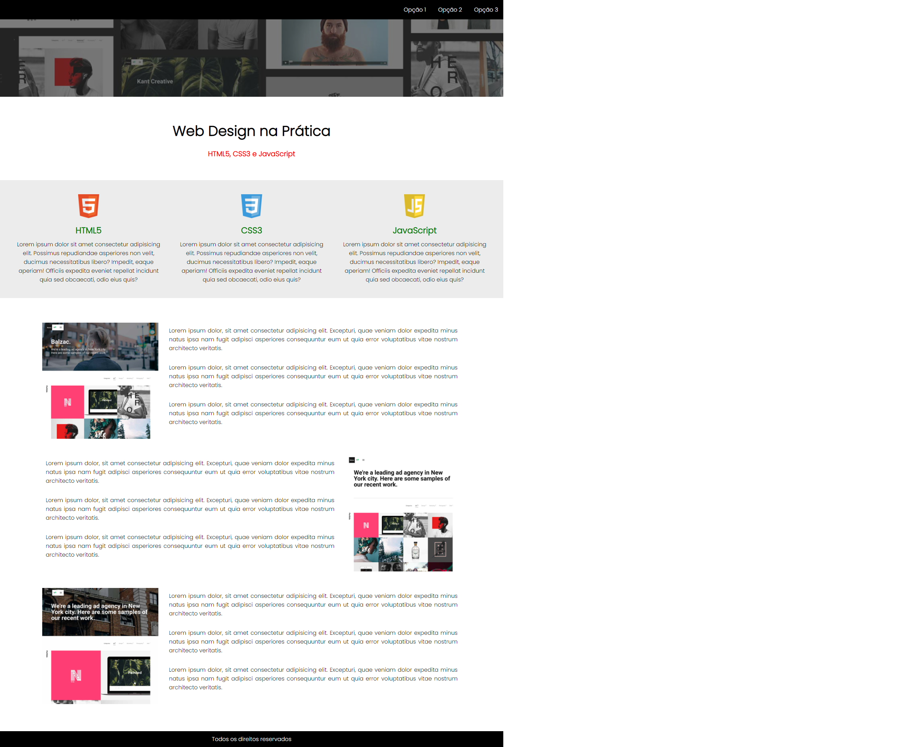
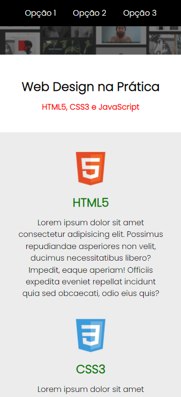

# layout-com-flexbox

## Sobre o projeto

Visite a demonstração em: [https://patriciamsro.github.io/layout-com-flexbox/index.html](https://patriciamsro.github.io/layout-com-flexbox/index.html)

Este projeto consiste em uma página proposta na disciplina Projeto Website Estático, do curso de `Sistemas para Internet` do `Institudo Federal de Educação, Ciência e Tecnologia do Triângulo Mineiro - IFTM`. 

A página contém um menu com animação, assim como o título principal.

A responsivividade do layout foi feita utilizando flexbox.

## Tecnologias utilizadas

* HTML5
* CSS3

## Layout Web


## Layout Mobile


## Como executar o projeto

Basta fazer o donwload e abrir o `index.html`, porém, se desejar fazer tudo pelo terminal siga os passos abaixo :stuck_out_tongue_winking_eye:: 

### - Windows:

Para clonar o projeto abra o terminal do **git bash**, em seguida faça o clone:
```bash
git clone https://github.com/patriciamsro/layout-com-flexbox.git
```

Em seguida, acesse a pasta do projeto:
```bash
cd layout-com-flexbox
```

Para abrir o projeto no seu navegador padrão:
```bash
start index.html
```

### - Linux:

Para clonar o projeto abra o terminal, em seguida faça o clone:
```bash
git clone https://github.com/patriciamsro/layout-com-flexbox.git
```

Em seguida, acesse a pasta do projeto:
```bash
cd layout-com-flexbox
```

Para abrir o projeto no **firefox**:
```bash
firefox index.html
```

Para abrir o projeto no **chrome**:
```bash
google-chrome index.html
```

## Autor

Patrícia Magalhães Sotero Rocha

[](https://www.linkedin.com/in/patr%C3%ADcia-sotero-71a803170/)